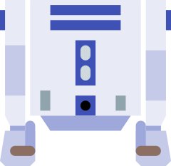

# protoArtoo

<p align="center">
  
</p>

**Open-source ESP32 body controller firmware for hoverboard-driven MK4 astromech droids.**

> An open-source firmware alternative for the [Artoo Controller PCB](https://artoo.uk).
> Written from scratch with full transparency and community extensibility in mind —
> leveraging the same excellent hardware with openly auditable code.

---

## What this is

The Artoo Controller is an ESP32-based body controller for R2-D2 style
astromech droids.

protoArtoo is that alternative firmware. It is written from scratch, properly documented,
tested, and designed to be understood and extended by the wider droid-building community.

### What it controls

- **Drive** — hoverboard motors via custom hoverboard firmware and serial UART communication
- **RC input** — three selectable modes: Standard PWM (6-channel), Single SBUS, or Dual SBUS
- **Audio** — pluggable backend: DY-SV5W (confirmed on hardware), CHIRP Audio Trigger, or
  SparkFun MP3 Trigger; abstract `AudioDriver` interface for future modules
- **Moods** — 15 presets coordinating body sounds and dome lighting; per-mood random chatter rate
- **Servo arms** — 2× MG996R utility arm servos via LEDC PWM
- **AUX outputs** — 3× configurable outputs (AUX1-3 on ARM3/ARM4/ARM5): MG996R, MG90S, RGB LED, or disabled
- **Dome motor** — ESC signal via LEDC PWM (tested: ISDT ESC70)
- **Dome link** — bidirectional Marcduino serial to AstroPixelsPlus over slip ring

### What makes it different from a classic MarcDuino build

| | Classic MarcDuino | protoArtoo |
|---|---|---|
| Body controller | ATmega328P | ESP32 (240 MHz, WiFi) |
| Dome controller | ATmega328P | AstroPixelsPlus ESP32 |
| Body→dome serial | TX only (one direction) | **Full-duplex bidirectional** |
| Sound location | Dome | **Body** — sole audio source |
| Drive | Sabertooth / JAW motors | Hoverboard (custom firmware) |
| RC input | PS2 via SHADOW Android app | RC receivers (PWM/SBUS) + any web browser |
| Board count | 2–3 MarcDuino PCBs | 2 ESP32 boards only |
| Firmware | Open source (ATmega328P) | **Open source (ESP32)** |

See [`docs/topology.md`](./docs/topology.md) for the full architectural comparison.
For project terms and abbreviations, see [`docs/terminology.md`](./docs/terminology.md).

---

## Core Hardware

**Required:**
- **Artoo Controller PCB v1.1** — body controller ([artoo.uk](https://artoo.uk))
  Requires the **dual-header ESP32 D1 Mini clone** (`wemos_d1_mini32`) — the elongated
  ~68 mm board with dual-row headers (~40 pins). This is a Chinese third-party clone,
  not an official Wemos/LOLIN board. No other ESP32 board fits the PCB socket.
- **Hoverboard** with custom firmware — drive motors via UART serial
  Compatible: [EFeru FOC](https://github.com/EFeru/hoverboard-firmware-hack-FOC) (STM32) or [RoboDurden Gen2.x](https://github.com/RoboDurden/Hoverboard-Firmware-Hack-Gen2.x-GD32) (GD32)

**Tested / Supported:**
- **RC receivers:** Dual SBUS, Single SBUS, or 6-channel PWM (tested: HOTRC 650)
- **Audio:** DY-SV5W (confirmed on hardware), CHIRP Audio Trigger, SparkFun MP3 Trigger
- **Servos:** MG996R/MG90S utility arms + 3× configurable AUX outputs
- **Dome motor:** Standard 50 Hz RC ESC (tested: ISDT ESC70)
- **Dome controller:** [AstroPixelsPlus fork](https://github.com/mattiasbrandt/AstroPixelsPlus) with bidirectional body link

GPIO assignments and wiring details: [`docs/pin_map.md`](./docs/pin_map.md)

---

## Repository structure

```
protoArtoo/
├── platformio.ini             # Build configuration and environment definitions
├── CHANGELOG.md               # All releases, conventional commits format
├── CONTRIBUTING.md            # Commit format, branch strategy, PR checklist
├── include/
│   ├── config.h               # GPIO pin assignments — source of truth
│   ├── robot_state.h          # RobotState struct, queues, mutexes
│   ├── audio_driver.h         # AudioDriver abstract interface
│   └── ...                    # Task interfaces, helpers, API snapshots
├── src/
│   ├── main.cpp
│   ├── tasks/                 # FreeRTOS tasks (Core 0: WiFi/web; Core 1: RT control)
│   │   ├── audio_task.cpp     # Sole writer to audio serial GPIO
│   │   ├── dome_link.cpp      # Bidirectional Marcduino serial link
│   │   ├── mood.cpp           # Mood preset dual-path dispatch
│   │   └── ...
│   ├── drivers/               # Hardware abstractions (audio backends, SBUS, Marcduino)
│   └── web/                   # REST API route handlers
├── data/                      # LittleFS web UI assets (HTML/JS/CSS)
│   ├── sound.html / sound.js  # Audio controls, module status, track configuration
│   ├── shell.js               # Shared page chrome (nav, topbar)
│   ├── web_api.js             # Shared fetch helpers and error policy
│   └── ...
├── test/
│   ├── test_native/           # Pure-logic tests — run on dev machine, no hardware
│   ├── test_embedded/         # On-device tests — requires flashed ESP32
│   ├── test_web/              # Node.js tests for web UI JavaScript
│   ├── test_rc_learn/         # RC calibration fixture (HTML, not a pio suite)
│   └── stubs/                 # Native-build stubs for ESP32 platform functions
├── tools/
│   ├── configure.py           # First-time setup wizard (writes user.mk)
│   ├── deploy.py              # Interactive build & deploy wizard (bare make)
│   ├── serial_monitor.py      # Serial monitor (holds DTR/RTS low — no accidental reset)
│   └── ...                    # check_deps.py, extract_version.py, requirements.txt
└── docs/
    ├── pin_map.md             # GPIO assignments and UART ownership
    ├── api.md                 # REST API reference
    ├── sound_playback.md      # Audio backend details and SD card layout
    ├── terminology.md         # Project glossary
    └── topology.md            # Classic MarcDuino vs protoArtoo architecture
```

---

## Build prerequisites

- [VS Code](https://code.visualstudio.com/) + [PlatformIO extension](https://platformio.org/install/ide?install=vscode)
- Python 3.8+
- `clang-format` (for code style enforcement — see `.clang-format`)

Open the repo in VS Code and accept the recommended extensions when prompted
(see `.vscode/extensions.json`).

---

## Building and flashing

```bash
git clone https://github.com/mattiasbrandt/protoArtoo.git
cd protoArtoo

# First-time only: configure audio module, OTA IP, and USB port (writes user.mk)
make setup

# First-time only: WiFi credentials (writes src/secrets.h, gitignored)
make setup-wifi

# Interactive build & deploy wizard — picks action, runs tests, flashes
make
```

`make setup` asks which audio backend you have, your OTA IP, and USB port, then writes
`user.mk`. All power-user shortcuts read from that file. All PlatformIO output streams
live; errors are highlighted if something goes wrong.

**Power-user shortcuts** (skip the wizard):

```bash
make build            # Compile only (no flash)
make ota              # Run tests + OTA flash — default audio module and IP
make ota-chirp        # Run tests + OTA flash — CHIRP module
make ota-mp3trigger   # Run tests + OTA flash — MP3 Trigger module
make flash            # Run tests + USB flash
make uploadfs         # Upload web UI only via OTA (no test gate)
make test             # Run native unit tests
make check            # Static analysis (cppcheck)
make monitor          # Serial monitor (no reset on connect)
make help             # List all named targets
```


---

## Running tests

```bash
# Fast — logic tests on dev machine, no hardware required
pio test -e native

# On-device — requires flashed ESP32
pio test -e protoArtoo

# Static analysis
pio check
```

---

## Companion project

The companion dome firmware is **[mattiasbrandt/AstroPixelsPlus](https://github.com/mattiasbrandt/AstroPixelsPlus)** — a fork of [reeltwo/AstroPixelsPlus](https://github.com/reeltwo/AstroPixelsPlus) extended with the **protoR2link** body-dome transport protocol.

Key changes from upstream:
- Sound disabled (`PREFERENCE_MARCSOUND = kNone`) — audio handled entirely by protoArtoo body
- Full-duplex **protoR2link** serial transport over slip ring (body ↔ dome, `#PAHB`/`#APHB` heartbeat at 1 Hz)
- Dome can trigger body sounds and arm commands via `sendBodyCommand()` — coordinated cross-controller sequences
- 4-state body link status badge in settings UI (Connected / Lost / Not seen / Disabled)
- WiFi/UDP fallback transport when slip-ring serial is unavailable

---

## Architecture overview

```
RC Transmitter ──SBUS──→  [protoArtoo — Artoo Controller PCB]  ←──WiFi──  Browser
                                 │                    │
                            UART1 (115200)        UART2 (9600)
                                 │                    │ bidirectional
                                 ↓                 serial link
                          Hoverboard              [protoR2link — dome]
                                                   • NeoPixel dome lights
                                                   • Panel servos
                                                   • Holoprojectors
                                                   • Logic displays
                                 ↓
                          soft-UART (9600)
                          Audio module
                          (body = sole audio source)
```

All Marcduino-compatible commands flow over the bidirectional serial link.
The dome has no local sound module. The body is the sole audio authority.

---

## Key Features

**Audio System**
- Three supported audio modules: DY-SV5W (confirmed on hardware), CHIRP Audio Trigger,
  and SparkFun MP3 Trigger — swap between them with a reflash, no rewiring
- Audio commands from any source — RC transmitter, web browser, or dome controller —
  are handled together without conflicts
- Named sound cues (scream, Leia, Cantina, Star Wars, Imperial March, and more) with
  track numbers configurable from the web UI
- Random ambient chatter with per-mood rate (Quiet: off, Mid-Awake: 30 s,
  Full-Awake: 20 s, Awake+: 10 s); all four intervals adjustable from the web UI

**Sound Page**
- Sound page with volume slider, named sound buttons, direct track play, random chatter
  settings, mood sound intervals, and a live Audio Module status card showing connection
  state, device type, play state, and track count from the module itself

**Moods and Sequences**
- 15 mood and sequence presets selectable from the dashboard or RC transmitter
- Mood selection plays audio on the body and forwards the matching dome lighting sequence
  when the dome link is active
- Last active mood restored on reboot

**Bidirectional Dome Link**
- Two-way serial over the slip ring (body ↔ dome, not just body → dome)
- Keepalive heartbeat at 1 Hz; connection state (Connected / Lost / Not seen) shown on the dashboard
- Dome can trigger body sounds and arm sequences — fully coordinated cross-controller choreography

**Dome Rotation**
- RC joystick control of dome motor speed and direction
- Live speed slider on the Dome page for direct manual control from any browser
- Speed limit cap configurable as a percentage — dial in how fast the dome is allowed to spin
- Random idle rotation: dome turns autonomously when no RC or web command is active;
  enable/disable and speed both adjustable from the Dome page
- ESC calibration values (neutral, min, max pulse) saved per-build — no recalibration needed after reflash
- Dome stops automatically on estop or sleep; resumes when cleared

**Three RC Input Modes**
- Switchable from the web UI without reflashing:
  - Standard PWM (6-channel)
  - Single SBUS
  - Dual SBUS
- In Single SBUS mode, active receiver switchable from the RC page without losing existing channel mappings
- Full channel remapping and calibration from the web UI; all settings saved across reboots

**Operator Web Interface**
- Desktop-first and tablet-second browser workflow — no app required
- Home dashboard with drive mode, mood selector, and live status
- Sound page, RC diagnostics, servo control, dome control, setup, and firmware update pages
- Real-time page updates — reconnects automatically when switching back to the tab
- Runtime log level selector (Error / Info / Debug) on Setup page — no reflash required

**Safety-First Architecture**
- Five independent failsafe layers from hardware through application
- Latching emergency stop — never auto-resets; must be cleared manually from the web UI
- Failsafe response time is measurable and logged

**Hardware Flexibility**
- Audio module is swappable — changing modules requires only a reflash, no hardware rewiring
- AUX outputs configurable per-channel: servo (MG996R or MG90S), RGB LED strip, or disabled
- Build-time WiFi mode: join your existing network or run as a standalone access point

**Modern Development Practices**
- Hundreds of native unit tests covering audio parsers, RC input, SBUS, failsafe logic,
  API responses, and more
- PlatformIO build system with static analysis
- Real-time control runs on a dedicated CPU core, isolated from network and web traffic
- Designed for community readability and extension — not a black box

---

## Safety

This firmware controls a 20 kg wheeled robot. The failsafe system has five
independent layers:

1. **RC receiver hardware failsafe** — receiver firmware, ~100 ms
2. **RC software watchdog** — 200 ms timeout in RC input task (all modes: PWM, SBUS)
3. **Web API drive timeout** — 500 ms; client must re-send to keep driving
4. **ESP32 Task Watchdog Timer** — 3 s reset; post-reset boot sets estop=true
5. **Hoverboard own UART timeout** — ~500 ms, independent of ESP32

`estop` requires explicit `POST /api/estop/clear` to clear. It does not auto-clear.

---

## Versioning

protoArtoo uses [Semantic Versioning 2.0.0](https://semver.org/) and
[Conventional Commits](https://www.conventionalcommits.org/).

- `feat:` → MINOR version bump
- `fix:` → PATCH version bump
- `feat!:` / `BREAKING CHANGE:` footer → MAJOR version bump

See [CHANGELOG.md](./CHANGELOG.md) for all releases.

---

## Contributing

See [CONTRIBUTING.md](./CONTRIBUTING.md) for commit format, branch strategy,
and pull request checklist.

Key rules:
- All commits follow [Conventional Commits](https://www.conventionalcommits.org/) format
- `pio test -e native` must pass before any upload or merge
- All code passes `pio check` before commit
- No WiFi credentials, no TBD GPIO guesses, no code that does not compile

Feature requests and improvement ideas are welcome. We cannot guarantee anything,
but we will review them honestly.

---

## Licence

MIT — see [LICENSE](./LICENSE)

---

## Acknowledgements

### Hardware — Artoo Controller PCB

**[Steve](https://www.artoo.uk/)** designed the Artoo Controller PCB that protoArtoo
runs on. The board provides a practical, purpose-built platform for MK4 astromech
droid body electronics: an ESP32 module with dedicated headers for RC receivers,
servo outputs, audio module, dome serial, and hoverboard UART — all in a compact
form factor. This ready-made hardware foundation made it possible to focus on
firmware development rather than board design. Steve's work on the hardware side
deserves full credit and recognition.

If you are building a droid and considering the Artoo Controller PCB:
👉 **[artoo.uk](https://www.artoo.uk/)**

---

### Firmware

**Hoverboard Firmware**

| Project | MCU | Description |
|---------|-----|-------------|
| [EFeru/hoverboard-firmware-hack-FOC](https://github.com/EFeru/hoverboard-firmware-hack-FOC) | STM32 | Original open-source hoverboard firmware with FOC (Field Oriented Control). Introduced the 8-byte UART protocol used by protoArtoo. |
| [RoboDurden/Hoverboard-Firmware-Hack-Gen2.x-GD32](https://github.com/RoboDurden/Hoverboard-Firmware-Hack-Gen2.x-GD32) | GD32F130 | Port for newer Gen2.x hoverboard mainboards. Compatible protocol. |

**Dome Controller**

| Project | Description |
|---------|-------------|
| [reeltwo/AstroPixelsPlus](https://github.com/reeltwo/AstroPixelsPlus) | Base dome controller firmware. Uses Reeltwo library for Marcduino command handling. |
| [mattiasbrandt/AstroPixelsPlus](https://github.com/mattiasbrandt/AstroPixelsPlus) | Fork with bidirectional body link support (heartbeat protocol, body command dispatch). |

### Libraries

**External Dependencies (via PlatformIO)**

| Library | Version | Purpose |
|---------|---------|---------|
| [ESPAsyncWebServer](https://github.com/ESP32Async/ESPAsyncWebServer) | 3.10.3 | Asynchronous HTTP/SSE server for web UI and REST API |
| [AsyncTCP](https://github.com/ESP32Async/AsyncTCP) | 3.4.10 | Async TCP library for ESP32 (required by ESPAsyncWebServer) |
| [ArduinoJson](https://github.com/bblanchon/ArduinoJson) | 7.4.3 | JSON serialization/deserialization for all API payloads |

**ESP32 Arduino Core (Built-in)**

| Component | Purpose |
|-----------|---------|
| `Preferences` | NVS (Non-Volatile Storage) for configuration persistence |
| `LittleFS` | Flash filesystem for web UI assets |
| `WiFi` | WiFi support — STA client or AP mode (build-time choice) |
| `LEDC` | PWM generation for servos and ESC |
| `FreeRTOS` | Task scheduling with core isolation (Core 0: network/web, Core 1: real-time control) |

---

### Community

**[Mr Baddeley](https://www.patreon.com/c/mrbaddeley)** — Creator of the
3D-printable MK4 astromech droid design. His print files, assembly guides, and
ongoing refinement work have made R2-D2 replica building accessible to thousands
of makers worldwide. The [Mr Baddeley Facebook Community](https://www.facebook.com/groups/MrBaddeley/)
is the primary hub for builders sharing progress, troubleshooting, and celebrating
their droids.

**[astromech.net](https://astromech.net/)** — The broader astromech building
community. The collective open knowledge around MarcDuino, SHADOW, panel wiring,
dome mechanics, and electronics is what makes personal droid builds possible.
This firmware is intended as a contribution back to that community.
